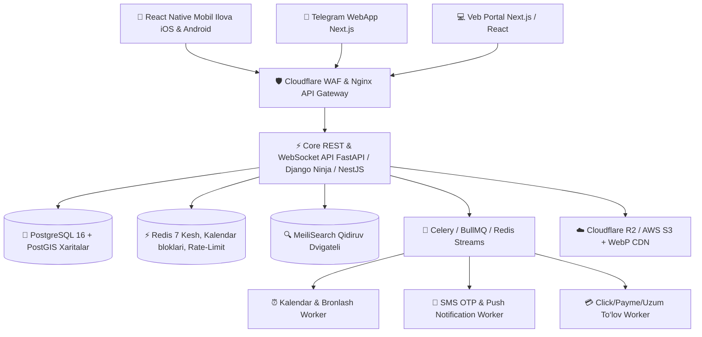

# 04. ENTERPRISE TIZIM ARXITEKTURASI VA TEXNOLOGIK STACK

> **Arxitektura standarti:** Global gigantlar (Airbnb, Uber, Booking.com) darajasidagi yuqori yuklamalarga chidamli (High-Load), 100K+ bir vaqtdagi foydalanuvchini ko‘tara oladigan **Modular Event-Driven Architecture**.

---

## 1. Global Texnologik Stack Xaritasi

---

## 2. Mobil Ilova Stacki (Mobile Architecture)

Mobil ilova eng yuqori standartdagi native tezlik va animatsiyalarni taʼminlashi shart:

* **Framework:** **React Native** + **Expo (SDK 51+ / Managed Workflow with EAS)**.
  - Bitta TypeScript kod bazasi orqali iOS (App Store) va Android (Play Store) ilovalarini 100% native unumdorlikda chiqarish.
* **Til:** **TypeScript (Strict Mode)** — 100% tip xavfsizligi.
* **Navigatsiya:** **Expo Router v3** (Faylga asoslangan universal routing, Deep Linking, Web va Mobile uchun yagona yo‘naltirish).
* **State Management:**
  - **Zustand:** Kichik, o‘ta tezkor mijoz holatlari (Savat, tanlangan filtrlar, UI mavzusi).
  - **TanStack Query (React Query v5):** Serverdan keladigan maʼlumotlarni keshda saqlash, offline ishlash, backgroundda avtomat yangilash.
* **Yuqori Unumdorlikli UI Komponentlar:**
  - **Shopify FlashList:** Minglab xizmat kartochkalarini 120 FPS da qotmasdan silliq aylantirish (FlatList ga qaraganda 10x tezroq).
  - **React Native Reanimated 3:** Native UI-thread da ishlovchi 60-120fps silliq fizika va animatsiyalar.
  - **NativeWind (Tailwind CSS v4):** Dizayn tizimini kodda juda toza va tezkor shakllantirish.
* **Offline-First Maʼlumotlar:** **MMKV Storage** — mobil qurilmada maʼlumotlarni saqlash (AsyncStorage dan 30x tezroq).

---

## 3. Backend va API Arxitekturasi

* **Asosiy API Service:** **FastAPI** yoki **Django Ninja / NestJS (TypeScript)**.
  - Asinxron I/O (`async/await`) — har bir server instansiyasi bir vaqtning o‘zida o‘n minglab ulanishlarni yengil ko‘taradi.
  - **Pydantic v2 / Zod:** Kiruvchi va chiquvchi maʼlumotlarni qatʼiy validatsiya qilish.
* **Real-time Aloqa (Jonli Kalendar va Chat):**
  - **WebSockets / Centrifugo:** Xizmat ko‘rsatuvchi biror kunni «Band» deb belgilagan zahoti, butun ilovadagi barcha mijozlar ekranidagi kalendarda shu sana soniya ulushida qizilga aylanadi (sahifani yangilash shart emas).
* **Background Vazifalar va Navbatlar (Task Queue):**
  - **Celery / BullMQ + Redis:** SMS xabarlar jo‘natish, to‘lovlarni tekshirish, kechasi to‘y eslatmalarini tayyorlash kabi og‘ir jarayonlar API ni sekinlashtirmasligi uchun fonda bajariladi.

---

## 4. Maʼlumotlar Bazasi va Kesh Tizimi

* **Asosiy Maʼlumotlar Bazasi:** **PostgreSQL 16+**
  - Barcha moliyaviy tranzaksiyalar, foydalanuvchilar, xizmatlar va buyurtmalar ACID kafolati bilan saqlanadi.
* **Geolokatsiya va Xaritalar:** **PostGIS kengaytmasi**
  - Foydalanuvchiga eng yaqin to‘yxonalarni radius (masofa) bo‘yicha topishda oddiy matematik formulalarga nisbatan 50 barobar tezroq ishlaydi (`ST_DWithin` va R-Tree fazoviy indekslari).
* **In-Memory Kesh va Bloklash:** **Redis 7+**
  - **Double-booking oldini olish (Distributed Locking - Redlock):** Agar ikki kishi bir vaqtning o‘zida bir xil to‘yxonaning 25-sentyabr kunini bron qilishga urinsa, Redis millisekundda birinchisini qabul qilib, ikkinchisini avtomat to‘xtatadi.
* **Qidiruv Dvigateli:** **MeiliSearch**
  - To‘yxona nomi, sanʼatkor ismi yoki xizmatlarni qidirishda xatoliklar bilan yozilganda ham (Typo-tolerance: masalan «tohyxona» deb yozsa ham «To‘yxona»ni topadi) 50 millisekundda javob beradi.

---

## 5. Media va Fayllar Infratuzilmasi

* **Storage:** **Cloudflare R2** yoki **AWS S3** (Chiqish trafigi uchun ortiqcha pul to‘lanmaydi).
* **Rasmlarni Avtomatik Optimizatsiya Qilish:**
  - Foydalanuvchi yoki fotograf 20MB lik 4K rasm yuklaganda, server uni avtomat ravishda bir nechta o‘lchamda (Thumbnail 300px, Medium 800px, High 1600px) va ultra-yengil **WebP / AVIF** formatiga o‘tkazadi.
  - Natijada ilova bir zumda ochiladi va mobil internet trafigini 80% tejaydi.

---

## 6. Xavfsizlik va Moliya Standartlari (FinTech Grade)

* **Autentifikatsiya:** JWT (JSON Web Tokens) — Access Token (15 daqiqa) + Refresh Token (30 kun, DB da aylanuvchi rotatsiya).
* **To‘lov Xavfsizligi (Click, Payme, Uzum):**
  - Har bir to‘lov so‘rovi uchun **Idempotency Key** — internet uzilib qayta yuborilganda pul ikki marta yechilmasligi kafolatlanadi.
  - Webhook signaturalarini SHA-256 HMAC orqali qatʼiy tekshirish.
* **Rate Limiting:** Har bir IP va foydalanuvchiga soniyasiga so‘rovlar chegarasi (DDoS va spam-botlardan himoya).

---

## 7. DevOps, CI/CD va Monitoring

* **Konteynerlashtirish:** **Docker & Docker Compose** (Ishlab chiqish va serverda bir xil muhit).
* **CI/CD:** **GitHub Actions**
  - Har bir commitda avtomat testlar va linter tekshiruvi.
  - **EAS Build:** iOS va Android (.ipa va .apk/aab) ilovalarini avtomat bulutda yig‘ib berish.
* **Kuzatuv (Observability):**
  - **Sentry:** Mobil ilovada yoki backendda biror xatolik (crash) yuz bersa, dasturchilarga darhol xabar kelishi.
  - **Grafana + Prometheus:** Server yuki, RAM, CPU va so‘rovlar sonini real-vaqt grafigida kuzatish.
