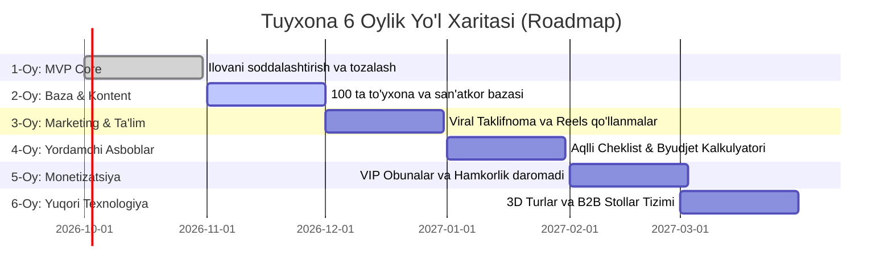

# 📅 TUYXONA: 6 OYLIK STRATEGIK VA AMALIY REJA (ROADMAP)
> **Asosiy maqsad:** Loyihadagi murakkablikni jilovlash, oddiy foydalanuvchilar (kelin-kuyovlar, ota-onalar va to'y xizmatchilari) tushunadigan va oson ishlatadigan darajaga keltirish, xalqqa o'rgatish va 6 oyda barqaror biznesga aylantirish.

---

## 🎯 BOSHQARUV PRINSIPI: "Avval soddalik, keyin innovatsiya"

Ko'p startaplar juda ko'p murakkab funksiyalarni (3D, sun'iy intellekt, murakkab jadvallar) bir vaqtda berib yuborishi natijasida oddiy xalq tushunmay ilovani o'chirib yuboradi. 

O'zbekistonda muvaffaqiyat qozongan barcha yirik loyihalar (**Yandex Go, Uzum, Click, Telegram**) eng sodda bitta muammoni hal qilishdan boshlagan:
1. **Odamlarga hozir nima kerak?**
   - Yaxshi to'yxona va san'atkorlarni topish, narxini bilish va telefon qilish.
   - Mehmonlarga Telegramdan chiroyli taklifnoma yuborish.
2. **Qolgan murakkab narsalar-chi?** (3D zallar, stollar sxemasi, onlayn to'yona fondi)
   - Bular — platformaning **"Premium & Wow"** qo'shimchalari bo'ladi, lekin asosiy yo'lni to'sib qo'ymasligi, oddiy foydalanuvchini cho'chitmasligi kerak.

---

## 🗺️ 6 OYLIK BOSQICHMA-BOSQICH REJA JADVALI

---

## 📌 HAR BIR OYNING ANIQ VAZIFALARI

### 🟢 1-OY: "Oddiylashtirish va Yadro Funksiyalar (Simplicity First)"
*Vazifa: Foydalanuvchi ilovaga kirganda adashib qolmasin, 5 soniyada nima qilish kerakligini tushunsin.*

1. **Interfeysni yengillashtirish (UX Audit):**
   - Bosh sahifada faqat eng kerakli 4 ta bo'lim:
     - 🏛️ **To'yxonalar**
     - 🎤 **San'atkorlar & Boshlovchilar**
     - 📸 **Foto & Video**
     - 🚘 **Kortej & Dekor**
   - Har bir xizmat kartochkasida faqat 3 ta aniq ma'lumot: **Rasm, Narx, Telefon qilish / Telegram tugmasi**.
2. **Murakkab funksiyalarni ikkinchi darajaga o'tkazish:**
   - 3D zallar va stollar xaritasini o'chirib tashlamaymiz, lekin ularni "Qo'shimcha qulaylik" tugmasi sifatida detal sahifasida ko'rsatamiz.
3. **Kelin va Kuyov rejimi:**
   - Kelinlar uchun nozik binafsha, kuyovlar uchun oltin rejimini saqlaymiz — bu ayollar auditoriyasiga kuchli yoqadi.

---

### 🟡 2-OY: "Kontent va Birinchi Hamkorlar (Toshkent va Vodiy)"
*Vazifa: Bo'sh ilovaga hech kim kirmaydi. Ilova ichida eng yaxshi, ishonchli xizmatlar to'la bo'lishi shart.*

1. **50 ta nufuzli to'yxona bazasi:**
   - Toshkent shahri va viloyatidagi eng talabgir to'yxonalar (Versal, Yakkasaroy, Mumtoz, Osiyo Grand va h.k.) fotosuratlari, sig'imi va narxlari.
2. **100 ta san'atkor, boshlovchi, video-operatorlar:**
   - Instagramdagi eng mashhur to'y xizmatlari bilan kelishuv yoki ularning ochiq portfoliosini joylashtirish.
3. **To'yxona ma'murlari bilan aloqa:**
   - Ularga tushuntirish: *"Biz sizga mijoz olib kelamiz, ilovamizda profilingiz bepul turadi"*.
   - Ma'mur uchun 1 sahifalik oddiy kalendar (qaysi kunlar bo'sh/band).

---

### 🔵 3-OY: "Viral Marketing va Odamlarni O'rgatish (Education & Launch)"
*Vazifa: Odamlarga ilovani qanday ishlatishni ko'rsatish va Raqamli Taklifnoma orqali tekin reklama qilish.*

1. **Raqamli Taklifnoma (Growth Engine):**
   - Kelin-kuyov ilovada o'z to'yining linkini oladi (`tuybox.uz/jasur-madina`).
   - Bu linkni Telegram orqali 300 ta mehmonga jo'natadi.
   - Natijada: **300 ta odam bir zumda Tuybox ilovasini ko'radi va bilib oladi!** Bu eng arzon va samarali reklama yo'li.
2. **Instagram / TikTok "Qo'llanma" videolari (15-30 soniya):**
   - *1-video:* "To'yxonama-to'yxona sarson bo'lib narx so'rab yurish joningizga tegdimi? Tuybox'da barcha narxlar ochiq!"
   - *2-video:* "Qog'oz taklifnomaga 2 million sarflamang — Telegramdan zamonaviy taklifnoma yuboring!"
   - *3-video:* "Kelinlar uchun maxsus Binafsha rejim!"

---

### 🟣 4-OY: "Smart Rejalashtirish (Cheklist & Byudjet Kalkulyatori)"
*Vazifa: Odamlar xizmat tanlab bo'lgach, to'y tayyorgarligi jarayonida ilovadan har kuni foydalanishini ta'minlash (Retention).*

1. **Aqlli To'y Cheklisti (Vazifalar):**
   - To'ygacha 30 kun qolganda nima qilish kerak? (ZAGS, sarpo, xonanda band qilish).
   - 15 kun qolganda nima qilish kerak? (Uzuk, fason o'lchash).
   - 3 kun qolganda nima qilish kerak? (Nahor oshi masalliqlari, tort).
2. **Byudjet Kalkulyatori:**
   - Kelin-kuyov o'z byudjetini kiritadi (masalan, 80 mln so'm) — ilova avtomatik taqsimlab beradi (To'yxonaga 40%, Xonandaga 15%, Foto/videoga 10%, Sarpo va liboslarga 20%).

---

### 🟠 5-OY: "Birinchi Daromad va Monetizatsiya (Revenue Phase)"
*Vazifa: Loyihaning o'zini oqlashi va xizmat ko'rsatuvchilardan daromad olish.*

1. **B2B VIP Obuna (Xizmat egalari uchun):**
   - To'yxonalar, xonandalar va fotografiyalar katalog boshida (TOP-3 talikda) turish uchun oylik obuna to'laydi (masalan, oyiga 300 000 – 1 000 000 so'm).
2. **Premium Taklifnoma Shablonlari:**
   - Oddiy taklifnoma bepul, lekin eksklyuziv oltin musiqa, 3D ochiladigan konvert va video-taklifnomalar uchun kichik to'lov (30 000 – 100 000 so'm).
3. **To'yona Fondu (Click / Payme):**
   - Uzoqdagi qarindoshlar yoki kela olmagan mehmonlar to'yona pulini onlayn o'tkazishi (tranzaksiyadan 1-2% komissiya).

---

### 🔴 6-OY: "Katta Texnologiyalarni Ishga Solish (3D Zallar & Avtomatlashtirish)"
*Vazifa: Xalq tizimga to'liq o'rganib olgach, xalqaro gigantlar darajasidagi texnologiyalarni to'laqonli yoqish.*

1. **3D Virtual Tur (To'yxonalar uchun katta xizmat):**
   - Toshkentdagi to'yxonalarga borib, ularning zalini 3D skaner qilib platformaga joylashtirishni to'yxonaga qimmat xizmat (2-5 mln so'm) sifatida sotish.
2. **Stollar va Mehmonlar Xaritasi (Seating Chart):**
   - Katta to'yxonalar ma'murlariga to'y kuni planshet orqali mehmonlarni joylashtirish dasturi sifatida taqdim etish.
3. **Viloyatlarga chiqish:**
   - Samarqand, Farg'ona, Andijon, Namangan to'yxonalari va san'atkorlarini platformaga integratsiya qilish.

---

## 💡 XULOSA: XALQQA O'RGATISH QOIDASI
> **Oddiy qoida:** "Agar 55 yoshli ota yoki 20 yoshli kelin ilovaga kirib, 3 ta klikda to'yxona raqamini topa olmasa yoki taklifnoma linkini ololmasa — murakkab 3D ham, sun'iy intellekt ham foyda bermaydi."
> 
> Shuning uchun biz dastlabki 3 oyni **Oddiy, Chiroyli, Tez va Foydali** qilib o'tkazamiz, keyingi oylarda esa kuchli texnologiyalarni bosqichma-bosqich qo'shamiz!
